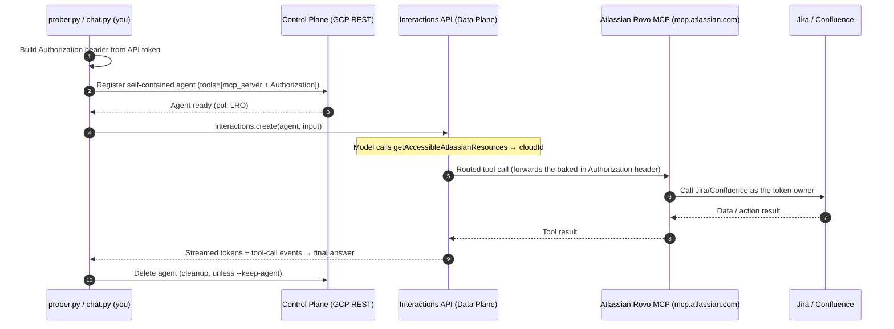

# Atlassian Chat Agent (Remote MCP)

This showcase builds a **multi-turn** agent that talks to your **Jira** and
**Confluence** by connecting to **Atlassian's official, fully-managed remote
Rovo MCP Server**. There is nothing to host: the Gemini Enterprise Agent
Platform routes the model's tool calls to `https://mcp.atlassian.com/v1/mcp`. The
shared, template-agnostic runners [`../prober.py`](../prober.py) (provisions the
agent + runs its example prompts) and [`../chat.py`](../chat.py) (interactive
multi-turn chat) drive it over the stateful **Interactions API**.

Unlike the [`mcp_support`](../mcp_support/README.md) example (which hosts a local
MCP server and tunnels it), the Rovo MCP server is already remote and
Atlassian-operated. Your only job is to enable API-token auth, create a token,
and let the platform forward it as an `Authorization` header. This mirrors the
[`workspace_chat_agent`](../workspace_chat_agent/README.md) architecture, but
with a simple Atlassian **API token** instead of an interactive Google OAuth
flow.

> **Reference:** [Getting started with the Atlassian Rovo MCP Server](https://support.atlassian.com/atlassian-rovo-mcp-server/docs/getting-started-with-the-atlassian-remote-mcp-server/)
> · [Authentication via API token](https://support.atlassian.com/atlassian-rovo-mcp-server/docs/configuring-authentication-via-api-token/)
> · [Supported tools](https://support.atlassian.com/atlassian-rovo-mcp-server/docs/supported-tools/)

---

## What's here

| File | Purpose |
| --- | --- |
| `agent.yaml` | Declares the `base_agent`, the remote Rovo MCP server (with per-server `auth`), and example prompts. |
| `AGENTS.md` | System instruction (support/triage persona + workflow + safety). |
| `requirements.txt` | Python dependencies. |
| `.env.example` | Template for your Atlassian credentials (copy to `.env`; git-ignored). |
| `demo/` | An end-to-end incident-triage demo: seeds a Confluence KB from official Kubernetes runbooks + baseline Jira bugs, then walks two use cases (file a bug from context; find the existing bug). See [demo/DEMO.md](demo/DEMO.md). |

The runners live one level up and are **template-agnostic** (both share
[`../agentkit.py`](../agentkit.py)):

*   **[`../prober.py`](../prober.py)** provisions a **self-contained** agent (the
    Rovo MCP server + your auth header baked in at registration) and runs the
    single-turn `examples` from `agent.yaml`. Add `--check` / `--list-tools` for
    an MCP preflight, or `--keep-agent` to keep it and print its id.
*   **[`../chat.py`](../chat.py)** is the interactive multi-turn chat client.

> **Interactions model note.** This project's Interactions API supports
> **agent-based** interactions only. Agents are registered with a `base_agent`
> (default `antigravity-preview-05-2026`) + a `base_environment`, and the MCP
> server + auth header are **baked into the agent** so a thin client can then
> chat with just `{agent, input}`.

---

## How authentication works

The agent calls Jira/Confluence through the Rovo MCP server using **your Atlassian
API token**, sent as an HTTP Basic `Authorization` header. You just put
`ATLASSIAN_EMAIL` + `ATLASSIAN_API_TOKEN` in `.env` (see [Setup](#setup)) —
`agent.yaml` turns them into the header, which is baked into the self-contained
agent at registration. The platform keeps it confidential to the Rovo URL and
never returns it.

For the generic `mcp_servers` → `auth.headers` format and `${...}` interpolation
used here, see the [root templates README](../README.md#remote-mcp-servers-mcp_servers).

> **cloudId** — With API-token auth the token isn't bound to a single Atlassian
> site, so every Jira/Confluence tool needs a `cloudId`. The Rovo tool schemas
> make `getAccessibleAtlassianResources` the entry point, so the model resolves it
> on its own.

---

## Architecture

Two independent credentials are in play:

1. **ADC** authenticates *your* call to the Interactions API (Data Plane) and the
   agent Control Plane.
2. An **Atlassian API token** is forwarded to the Rovo MCP server as an
   `Authorization` header so it can act on your Atlassian data with your
   permissions.



---

## Setup

### 1. Prerequisites
- Python 3.10+ and the `gcloud` CLI.
- A Google Cloud project with the Vertex AI API enabled.
- An Atlassian Cloud account with Jira and/or Confluence.
- **Your Atlassian org admin must enable "authentication via API token" for the
  Rovo MCP server.** See
  [Control Atlassian Rovo MCP server settings](https://support.atlassian.com/security-and-access-policies/docs/control-atlassian-rovo-mcp-server-settings/).
  Admins also grant the read/write **permission groups** that gate the tools.

### 2. Authenticate ADC (for the Interactions API + Control Plane)
```bash
gcloud auth application-default login
gcloud config set project YOUR_PROJECT_ID
gcloud services enable aiplatform.googleapis.com
```

### 3. Provide your credentials

Get an Atlassian API token from
**https://id.atlassian.com/manage-profile/security/api-tokens**
(use **Create API token with scopes** — a classic token won't work with Rovo MCP).
Copy it and note the owner's email.

Then copy the example env file and paste them in:
```bash
cd agent_templates/atlassian_chat_agent
cp .env.example .env
$EDITOR .env
```
```bash
ATLASSIAN_EMAIL="you@example.com"
ATLASSIAN_API_TOKEN="your_api_token"
ATLASSIAN_SITE="https://your-site.atlassian.net"
```
Both `prober.py` and `chat.py` **auto-load this template's `.env`**, so you don't
need to source it manually (shell-exported vars still take precedence).

### 4. Install dependencies
```bash
python3 -m venv venv
./venv/bin/pip install -r requirements.txt
```

---

## Run it

Commands below run from the repo root using the repo's venv. Both `prober.py`
and `chat.py` live in `agent_templates/` and work with any template.

### Preflight — verify the token + MCP connectivity (no model call)
```bash
./venv/bin/python3 agent_templates/prober.py agent_templates/atlassian_chat_agent --check
./venv/bin/python3 agent_templates/prober.py agent_templates/atlassian_chat_agent --list-tools
```
This builds the auth header and speaks raw MCP (`initialize` + `tools/list`) to
the Rovo server, printing the tools your token can see.

### Run the example prompts from `agent.yaml`
```bash
./venv/bin/python3 agent_templates/prober.py agent_templates/atlassian_chat_agent --project YOUR_PROJECT
```
`prober` registers a self-contained agent, runs each example single-turn, then
deletes it. Add an ad-hoc prompt to override the examples, or `--keep-agent` to
keep the agent (it prints the id) so you can chat with it.

### Interactive, multi-turn chat
Provision from the template and chat in one command:
```bash
./venv/bin/python3 agent_templates/chat.py --from-template agent_templates/atlassian_chat_agent --project YOUR_PROJECT
```
Or attach to an agent you kept earlier (`prober … --keep-agent` prints the id):
```bash
./venv/bin/python3 agent_templates/chat.py --agent <agent-id> --project YOUR_PROJECT
```
Each turn is chained with `previous_interaction_id`, so the agent remembers the
resolved `cloudId` and prior context across the conversation.

### Try write actions (interactive)
Writes are enabled, and the agent confirms before mutating. For example:
```
you > Create a Task in the PLATFORM project titled "Spike: evaluate caching" with a short description.
you > Move PLATFORM-123 to "In Review" and add a comment that the PR is up.
you > Create a Confluence page in the TEAM space summarizing this conversation.
```

### Useful flags
| Runner | Flag | Effect |
| --- | --- | --- |
| both | `--project PROJECT` | GCP project (overrides `GOOGLE_CLOUD_PROJECT` / ADC). |
| prober | `--check` / `--list-tools` | MCP connectivity/token preflight, then exit. |
| prober | `--keep-agent` | Keep the agent after running and print its id. |
| chat | `--agent <id\|resource>` | Chat with an existing (self-contained) agent. |
| chat | `--from-template DIR` | Register a self-contained agent from a template, chat, then delete on exit. |
| chat | `--keep-agent` | With `--from-template`: keep the agent after exit. |
| chat | `--mcp-url URL` | Override a single MCP server URL for `--from-template`. |
| chat | `--no-stream` | Disable token streaming. |

> MCP auth is declared **per server** in `agent.yaml` (`mcp_servers[].auth`) and
> resolved from the env vars it names — there are no credential flags.

---

## How the MCP tool is wired

Both runners bake the Rovo server into the agent at **registration** (Control
Plane), so the agent is self-contained:

```python
register_agent(..., tools=[{
    "type": "mcp_server",
    "name": "atlassian",
    "url": "https://mcp.atlassian.com/v1/mcp",
    "headers": {"Authorization": "Basic <base64(email:api_token)>"},
}])
```

Then every interaction is a thin `{agent, input}` turn — no tools injected per
call. The platform routes tool calls to the MCP URL and keeps the header
confidential to that URL.

> **SDK note:** Use `google-genai >= 2.0.0`. Legacy SDKs
> (`google-cloud-aiplatform`, `google-generativeai`) do not support the
> Interactions API. Use current models only (e.g. `gemini-2.5-pro`,
> `gemini-3-flash-preview`); `gemini-2.0`/`1.5` are unsupported.

### Why self-contained (baked-in) MCP?

Baking the MCP server into the agent is what lets **any** client drive it — a
turn is just `{agent, input}`, so a generic/unified chat front-end (e.g. Gemini
Enterprise / Agentspace UI) works without knowing the agent's MCP config. The
alternative — injecting the `mcp_server` tool per interaction (Data Plane) — is
still supported by `agentkit.stream_interaction(..., tools=...)` for programmatic
clients that manage per-user tokens, but a unified app can't do that.

> **Per-user identity:** a baked-in static API token means every caller acts as
> that one identity. For true per-user identity through a shared agent, use the
> Rovo MCP server's **OAuth 2.1** instead of a static header.

> **Tool-type note (verified against the live API):** for MCP servers the
> Control Plane accepts tool type **`mcp_server`** (the same as the Data Plane);
> the older `type: mcp` is rejected.

> **Tool-type gotcha (verified against the live API):** for MCP servers the
> Control Plane accepts tool type **`mcp_server`** — the same as the Data Plane.
> The older `type: mcp` is rejected (`Unsupported tool type: mcp. Supported: [...,
> mcp_server, ...]`).

---

## Troubleshooting

- **`401`/`403` in `--check`:** the org admin hasn't enabled API-token auth for
  the Rovo MCP server, the token is wrong/expired, or (Basic) the `email:token`
  pair is malformed. Recreate the token and re-source `.env`.
- **"caller does not have permission" on a tool:** the token's scopes or the
  org's permission groups don't allow that tool. For writes, ensure the
  `write_jira` / `write_confluence` groups and write scopes are granted.
- **Agent asks which site / picks the wrong one:** you have access to multiple
  Atlassian sites. Name the site in your prompt (the agent resolves `cloudId`
  via `getAccessibleAtlassianResources`).
- **Empty results:** the account simply has no matching data, or your JQL/CQL is
  too narrow.
- **`invalid model` / interaction errors:** pick a current model in `agent.yaml`
  or via `--base-agent`.
- **Only 3 tools listed (`getTeamworkGraph*`) in `--list-tools`:** your token is
  a **classic (unscoped)** API token. Rovo MCP maps each Jira/Confluence tool to
  required scopes, so you need an **API token _with scopes_** — create one via
  the scoped flow
  ([id.atlassian.com …?appId=mcp&selectedScopes=all](https://id.atlassian.com/manage-profile/security/api-tokens?autofillToken&expiryDays=max&appId=mcp&selectedScopes=all))
  and re-source `.env`. A scoped token unlocks the full toolset (~45 tools).
- **`403 aiplatform.agents.create denied`:** an IAM / identity problem on the
  GCP side, not Atlassian. Two common causes:
  - **Wrong project.** The Gen AI client resolves the project from `--project`,
    then `GOOGLE_CLOUD_PROJECT`, then the **ADC quota project** — which may differ
    from your `gcloud config` project. Always pass `--project YOUR_PROJECT`.
  - **Wrong ADC identity.** Client libraries use **ADC**, not your `gcloud`
    active account. If they differ (e.g. `gcloud auth list` shows one account but
    ADC is another), re-point ADC at the account that has a Vertex AI agent role
    on the project:
    ```bash
    gcloud auth application-default login
    gcloud auth application-default set-quota-project YOUR_PROJECT
    ```

## Security

- Your Atlassian API token is a credential — treat it like a password. It lives
  only in `.env` (git-ignored) / your shell env and is forwarded solely to the
  Rovo MCP URL, per turn. It is never stored on the registered agent.
- The agent's system instruction (`AGENTS.md`) tells it to prefer read/search,
  **confirm before mutating**, and treat issue/page content as untrusted data
  (indirect prompt-injection defense). Still review any action the agent
  proposes — MCP tools can read and modify real Jira/Confluence data.
- Prefer **least privilege**: scope the token to only what you need, and use
  read-only scopes for demos.
