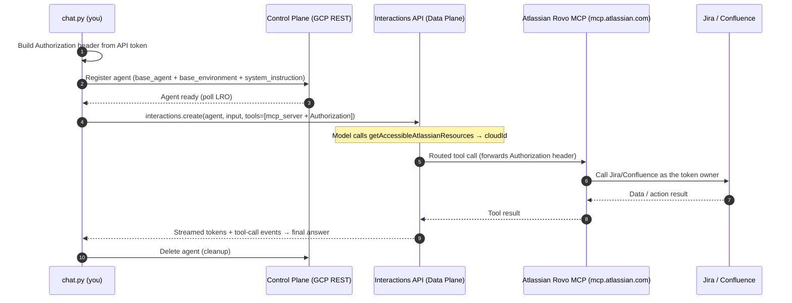

# Atlassian Chat Agent (Remote MCP)

This showcase builds a **multi-turn** agent that talks to your **Jira** and
**Confluence** by connecting to **Atlassian's official, fully-managed remote
Rovo MCP Server**. There is nothing to host: the Gemini Enterprise Agent
Platform routes the model's tool calls to `https://mcp.atlassian.com/v1/mcp`, and
this template's standalone `chat.py` drives the whole thing over the stateful
**Interactions API**.

Unlike the [`mcp_support`](../mcp_support/README.md) example (which hosts a local
MCP server and tunnels it), the Rovo MCP server is already remote and
Atlassian-operated. Your only job is to enable API-token auth, create a token,
and let the platform forward it as an `Authorization` header. This mirrors the
[`workspace_chat_agent`](../workspace_chat_agent/README.md) architecture, but
with a simple Atlassian **API token** instead of an interactive Google OAuth
flow.

> **Reference:** [Getting started with the Atlassian Rovo MCP Server](https://support.atlassian.com/atlassian-rovo-mcp-server/docs/getting-started-with-the-atlassian-remote-mcp-server/)
> · [Authentication via API token](https://support.atlassian.com/atlassian-rovo-mcp-server/docs/configuring-authentication-via-api-token/)
> · [Supported tools](https://support.atlassian.com/atlassian-rovo-mcp-server/docs/supported-tools/)

---

## What's here

| File | Purpose |
| --- | --- |
| `agent.yaml` | Declares the `base_agent`, the remote Rovo MCP server, the auth mode, and example prompts. |
| `AGENTS.md` | System instruction (persona + workflow + safety) for the agent, including the **cloudId-first** rule. |
| `chat.py` | Standalone runner: builds the Atlassian auth header → **registers an agent (Control Plane)** → calls it via the **Interactions API** with the MCP tool → cleans up. **Replaces prober.py for this template.** |
| `requirements.txt` | Python dependencies. |
| `.env.example` | Template for your Atlassian credentials (copy to `.env`; git-ignored). |

> **Interactions model note.** This project's Interactions API supports
> **agent-based** interactions only. So `chat.py` registers an agent with
> `base_agent` (default `antigravity-preview-05-2026`) + a `base_environment`,
> then calls it with `background=True`, supplying the MCP server + auth header
> **per turn** (so no secret is stored on the agent).

---

## How authentication works

The Rovo MCP server supports **non-interactive API-token auth** — the client
sends credentials directly in the `Authorization` header (no browser consent).
`chat.py` supports both documented mechanisms:

| Mode | Credential | Header sent to Rovo MCP |
| --- | --- | --- |
| `basic` (default) | Personal API token | `Authorization: Basic base64(email:api_token)` |
| `bearer` | Service-account API key | `Authorization: Bearer <api_key>` |

The platform forwards this header **only** to the Rovo MCP URL, and `chat.py`
supplies it turn-scoped, so the token is never persisted on the agent.

> **cloudId matters.** With API-token auth the token is **not** bound to a single
> Atlassian site, and every Jira/Confluence tool needs a `cloudId`. The agent's
> `AGENTS.md` therefore instructs it to call **`getAccessibleAtlassianResources`
> first** to resolve the `cloudId`, then reuse it for the rest of the
> conversation.

---

## Architecture

Two independent credentials are in play:

1. **ADC** authenticates *your* call to the Interactions API (Data Plane) and the
   agent Control Plane.
2. An **Atlassian API token** is forwarded to the Rovo MCP server as an
   `Authorization` header so it can act on your Atlassian data with your
   permissions.



---

## Setup

### 1. Prerequisites
- Python 3.10+ and the `gcloud` CLI.
- A Google Cloud project with the Vertex AI API enabled.
- An Atlassian Cloud account with Jira and/or Confluence.
- **Your Atlassian org admin must enable "authentication via API token" for the
  Rovo MCP server.** See
  [Control Atlassian Rovo MCP server settings](https://support.atlassian.com/security-and-access-policies/docs/control-atlassian-rovo-mcp-server-settings/).
  Admins also grant the read/write **permission groups** that gate the tools.

### 2. Authenticate ADC (for the Interactions API + Control Plane)
```bash
gcloud auth application-default login
gcloud config set project YOUR_PROJECT_ID
gcloud services enable aiplatform.googleapis.com
```

### 3. Create an Atlassian API token
Create a personal API token (with the scopes you need) at
[id.atlassian.com/manage-profile/security/api-tokens](https://id.atlassian.com/manage-profile/security/api-tokens?autofillToken&expiryDays=max&appId=mcp&selectedScopes=all).
Note the **email** of the token owner.

> To enable writes (create/update issues, transitions, create/update pages),
> the token's scopes and the org's permission groups must include the
> `write_jira` / `write_confluence` groups. Read/search work with read scopes.

### 4. Provide your credentials
Copy the example env file and fill it in:
```bash
cd agent_templates/atlassian_chat_agent
cp .env.example .env
$EDITOR .env            # set ATLASSIAN_EMAIL + ATLASSIAN_API_TOKEN
set -a && source .env && set +a
```
(Or pass `--email` / `--api-token` on the command line.)

### 5. Install dependencies
```bash
python3 -m venv venv
./venv/bin/pip install -r requirements.txt
```

---

## Run it

All commands are from this directory using the template's venv.

### Preflight — verify the token + MCP connectivity (no model call)
```bash
./venv/bin/python3 chat.py --check
```
This builds the auth header and speaks raw MCP (`initialize` + `tools/list`) to
the Rovo server, printing the tools your token can see.

### List the tools the server offers
```bash
./venv/bin/python3 chat.py --list-tools
```

### Run the example prompts from `agent.yaml`
```bash
./venv/bin/python3 chat.py
```

### Ad-hoc prompt
```bash
./venv/bin/python3 chat.py "Find the highest-priority open bugs in the PLATFORM project."
```

### Interactive, multi-turn chat (stateful)
```bash
./venv/bin/python3 chat.py --interactive
```
Each turn is chained with `previous_interaction_id`, so the agent remembers the
resolved `cloudId` and prior context across the conversation.

### Try write actions (interactive)
Writes are enabled, and the agent confirms before mutating. For example:
```
you > Create a Task in the PLATFORM project titled "Spike: evaluate caching" with a short description.
you > Move PLATFORM-123 to "In Review" and add a comment that the PR is up.
you > Create a Confluence page in the TEAM space summarizing this conversation.
```

### Useful flags
| Flag | Effect |
| --- | --- |
| `--project PROJECT` | GCP project for the Interactions API (overrides `GOOGLE_CLOUD_PROJECT`). |
| `--auth-mode basic\|bearer` | Choose personal-token (Basic) or service-key (Bearer) auth. |
| `--email` / `--api-token` | Basic-auth credentials (else from env). |
| `--api-key` | Bearer-auth service-account key (else from env). |
| `--base-agent NAME` | Override the runtime `base_agent` from agent.yaml. |
| `--mcp-url URL` | Override the Rovo MCP endpoint. |
| `--keep-agent` | Do not delete the registered agent after the run. |
| `--no-stream` | Disable token streaming. |

---

## How the MCP tool is wired

`chat.py` passes the Rovo server as a turn-scoped `mcp_server` tool on each
Interactions API call:

```python
client.interactions.create(
    agent=agent_resource,
    input="What's the status of PROJ-1234?",
    tools=[{
        "type": "mcp_server",
        "name": "atlassian",
        "url": "https://mcp.atlassian.com/v1/mcp",
        "headers": {"Authorization": "Basic <base64(email:api_token)>"},
    }],
    store=True,
    stream=True,
    background=True,
)
```

Because `tools` and the auth header are turn-scoped, the token is supplied fresh
on every turn and never stored on the agent.

> **SDK note:** Use `google-genai >= 2.0.0`. Legacy SDKs
> (`google-cloud-aiplatform`, `google-generativeai`) do not support the
> Interactions API. Use current models only (e.g. `gemini-2.5-pro`,
> `gemini-3-flash-preview`); `gemini-2.0`/`1.5` are unsupported.

---

## Troubleshooting

- **`401`/`403` in `--check`:** the org admin hasn't enabled API-token auth for
  the Rovo MCP server, the token is wrong/expired, or (Basic) the `email:token`
  pair is malformed. Recreate the token and re-source `.env`.
- **"caller does not have permission" on a tool:** the token's scopes or the
  org's permission groups don't allow that tool. For writes, ensure the
  `write_jira` / `write_confluence` groups and write scopes are granted.
- **Agent asks which site / picks the wrong one:** you have access to multiple
  Atlassian sites. Name the site in your prompt (the agent resolves `cloudId`
  via `getAccessibleAtlassianResources`).
- **Empty results:** the account simply has no matching data, or your JQL/CQL is
  too narrow.
- **`invalid model` / interaction errors:** pick a current model in `agent.yaml`
  or via `--base-agent`.
- **Only 3 tools listed (`getTeamworkGraph*`) in `--list-tools`:** your token is
  a **classic (unscoped)** API token. Rovo MCP maps each Jira/Confluence tool to
  required scopes, so you need an **API token _with scopes_** — create one via
  the scoped flow
  ([id.atlassian.com …?appId=mcp&selectedScopes=all](https://id.atlassian.com/manage-profile/security/api-tokens?autofillToken&expiryDays=max&appId=mcp&selectedScopes=all))
  and re-source `.env`. A scoped token unlocks the full toolset (~45 tools).
- **`403 aiplatform.agents.create denied`:** an IAM / identity problem on the
  GCP side, not Atlassian. Two common causes:
  - **Wrong project.** The Gen AI client resolves the project from `--project`,
    then `GOOGLE_CLOUD_PROJECT`, then the **ADC quota project** — which may differ
    from your `gcloud config` project. Always pass `--project YOUR_PROJECT`.
  - **Wrong ADC identity.** Client libraries use **ADC**, not your `gcloud`
    active account. If they differ (e.g. `gcloud auth list` shows one account but
    ADC is another), re-point ADC at the account that has a Vertex AI agent role
    on the project:
    ```bash
    gcloud auth application-default login
    gcloud auth application-default set-quota-project YOUR_PROJECT
    ```

## Security

- Your Atlassian API token is a credential — treat it like a password. It lives
  only in `.env` (git-ignored) / your shell env and is forwarded solely to the
  Rovo MCP URL, per turn. It is never stored on the registered agent.
- The agent's system instruction (`AGENTS.md`) tells it to prefer read/search,
  **confirm before mutating**, and treat issue/page content as untrusted data
  (indirect prompt-injection defense). Still review any action the agent
  proposes — MCP tools can read and modify real Jira/Confluence data.
- Prefer **least privilege**: scope the token to only what you need, and use
  read-only scopes for demos.
