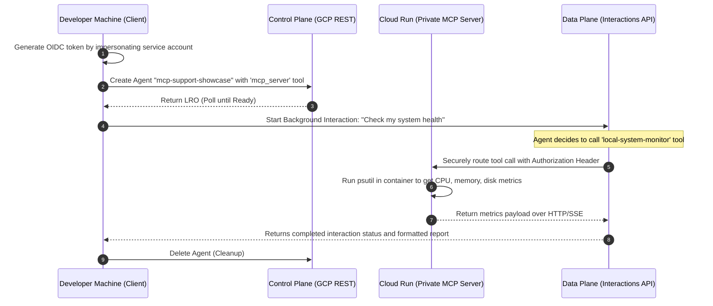

# The Secure Hybrid MCP Support Bot

This example demonstrates how to connect a cloud-hosted agent to an **MCP (Model Context Protocol) server**. This architecture allows the cloud agent to securely invoke custom tools (such as retrieving system hardware metrics) hosted on an external server.

The MCP server is built using the official `mcp` Python SDK's `FastMCP` class and hosted as an **SSE (Server-Sent Events)** application mounted inside **FastAPI**.

We provide two deployment options:
1.  **Local Deployment with Tunneling (Zero-Install)**: Great for quick local testing without installing third-party utilities.
2.  **Cloud Deployment with Cloud Run (Private)**: Recommended for restricted or corporate networks (like Google's) where outbound SSH/tunneling tools are blocked.

---

## Flow Diagram (Cloud Run Deployment)



---

## Option 1: Local Deployment with Tunneling

This option runs the MCP server locally on your machine and exposes it via a secure SSH-based reverse tunnel.

### 1. Start the Local MCP Server
From the `agent_templates` directory, start the FastAPI server hosting the MCP tool:
```bash
python mcp_support/mcp_server.py
```
The server will start on `http://localhost:8000`, with the SSE connection endpoint at `http://localhost:8000/sse` and the message endpoint at `http://localhost:8000/messages`.

### 2. Start a Zero-Install Tunnel
In a **second terminal**, run this command to establish a secure reverse SSH tunnel using `localhost.run` (no registration or local binary installation required):
```bash
ssh -o StrictHostKeyChecking=no -R 80:localhost:8000 nokey@localhost.run
```

Look for the forwarded HTTPS domain in the output (e.g., `https://xxxx.lhr.life`).

### 3. Run the prober
In a **third terminal**, set the forwarded HTTPS URL as an environment variable and run the prober:
```bash
export MCP_SERVER_URL="https://your-tunnel-subdomain.lhr.life/sse"
./venv/bin/python3 agent_templates/prober.py agent_templates/mcp_support
```

The cloud agent will connect back to your local machine, run the metrics collection tool, and return a system health report!

---

## Option 2: Cloud Deployment with Cloud Run (Private)

This option deploys the MCP server as a private, secure containerized service on Google Cloud Run. 

### 1. Setup the Build Service Account (One-time)
Create a dedicated service account and grant it the necessary roles to build and deploy the container. Run these commands from your terminal:

```bash
# Create the service account
gcloud iam service-accounts create mcp-build-sa --display-name="MCP Build Service Account"

# Grant roles to the service account
gcloud projects add-iam-policy-binding YOUR_PROJECT_ID --member="serviceAccount:mcp-build-sa@YOUR_PROJECT_ID.iam.gserviceaccount.com" --role="roles/cloudbuild.builds.builder"
gcloud projects add-iam-policy-binding YOUR_PROJECT_ID --member="serviceAccount:mcp-build-sa@YOUR_PROJECT_ID.iam.gserviceaccount.com" --role="roles/storage.admin"
gcloud projects add-iam-policy-binding YOUR_PROJECT_ID --member="serviceAccount:mcp-build-sa@YOUR_PROJECT_ID.iam.gserviceaccount.com" --role="roles/artifactregistry.admin"
gcloud projects add-iam-policy-binding YOUR_PROJECT_ID --member="serviceAccount:mcp-build-sa@YOUR_PROJECT_ID.iam.gserviceaccount.com" --role="roles/logging.logWriter"

# Grant yourself permission to impersonate the service account
gcloud iam service-accounts add-iam-policy-binding mcp-build-sa@YOUR_PROJECT_ID.iam.gserviceaccount.com \
    --member="user:YOUR_EMAIL@example.com" \
    --role="roles/iam.serviceAccountUser"
```
*(Note: Ensure your user account also has the `roles/iam.serviceAccountTokenCreator` role on the project to allow token generation).*

### 2. Deploy the MCP Server to Cloud Run
From the `agent_templates` directory, deploy the server. This will upload the source, build the image via Cloud Build, and deploy it as a private service:
```bash
gcloud run deploy mcp-server \
    --source mcp_support \
    --region us-central1 \
    --allow-unauthenticated \
    --build-service-account="projects/YOUR_PROJECT_ID/serviceAccounts/mcp-build-sa@YOUR_PROJECT_ID.iam.gserviceaccount.com"
```

### 3. Run the prober
Copy the **Service URL** outputted by the deployment (e.g., `https://mcp-server-xxx.run.app`), append `/sse` to it, set it as an environment variable, and run the prober:
```bash
export MCP_SERVER_URL="https://mcp-server-xxx.run.app/sse"
./venv/bin/python3 agent_templates/prober.py agent_templates/mcp_support
```
