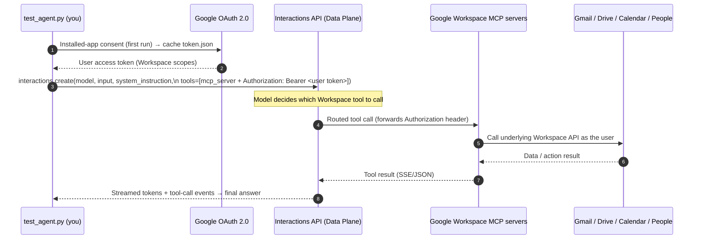

# Google Workspace Chat Agent (Remote MCP)

This showcase builds an agent that talks to your **Google Workspace** — Gmail,
Drive, Calendar, People/Contacts, and (optionally) Google Chat — by connecting
to **Google's fully-managed remote MCP servers**. There is nothing to host: the
Gemini Enterprise Agent Platform routes the model's tool calls to Google's MCP
endpoints, and this template's standalone `test_agent.py` drives the whole thing
over the stateful **Interactions API**.

Unlike the [`mcp_support`](../mcp_support/README.md) example (which hosts a local
MCP server and tunnels it), the Workspace MCP servers are already remote and
Google-operated. Your only job is to enable them in a Cloud project, grant OAuth
scopes, and supply a per-user access token.

> **Developer Preview.** The Google Workspace remote MCP servers are part of the
> [Google Workspace Developer Preview Program](https://developers.google.com/workspace/preview).
> Availability and tools may change. Official setup guide:
> [Configure the Google Workspace MCP servers](https://developers.google.com/workspace/guides/configure-mcp-servers).

---

## Verified status & the live-data-access gate (read this first)

This template has been exercised end-to-end. **Verified working:**

- OAuth token minting (installed-app flow) with the Workspace scopes.
- The token reads real Gmail/People **directly** via the Workspace REST APIs (HTTP 200).
- MCP connectivity: `initialize` + `tools/list` against all servers; full tool
  catalogs discovered.
- Agent registration (Control Plane), and the **Interactions API calling the
  agent**, with the agent actually invoking the MCP tools.

**The one remaining blocker is external to this code:** MCP tool *execution*
returns `isError: "The caller does not have permission"` from the downstream
Workspace call — identically whether driven through the agent or via raw
`mcp_local_test.py`. We ruled out scopes, quota/consumer project, token audience
(auth returns HTTP 200, not 401), and the RFC 8707 resource indicator.

**Root cause:** the Workspace MCP servers are **Developer Preview** features, and
*data access* is gated behind **Developer Preview Program enrollment of the
calling account + Cloud project**. Enrollment requires a **Google Workspace
account** (consumer `@gmail.com` accounts are not eligible) and Google
registering your project (takes a few days). Enabling the `*mcp.googleapis.com`
services is **necessary but not sufficient** — the project must also be
registered in the preview program.

### Path to live data access
1. Use a **Google Workspace account** (not consumer Gmail) and its Cloud project.
2. Enroll that account + project in the
   [Developer Preview Program](https://developers.google.com/workspace/preview)
   (application form; ~a couple of days for project registration).
3. Configure OAuth (below) and run `test_agent.py`. Once the project is
   preview-registered, tool execution stops returning "caller does not have
   permission".

> Googlers: your corp account/projects likely already have preview access, but
> corp Workspace policy may block third-party OAuth consent for Gmail/Calendar
> scopes. An **Internal** OAuth client in a corp-org project may be required.

---

## What's here

| File | Purpose |
| --- | --- |
| `agent.yaml` | Declares the `base_agent`, the remote MCP servers, the OAuth scopes, and example prompts. |
| `AGENTS.md` | System instruction (persona + workflow + safety) for the agent. |
| `test_agent.py` | Standalone runner: OAuth → **registers an agent (Control Plane)** → calls it via the **Interactions API** with the MCP tools → cleans up. **Replaces prober.py for this template.** |
| `mcp_local_test.py` | Agent-free tester: mints a token and speaks **raw MCP** (initialize/tools/list/tools/call) directly to one server. Great for isolating auth issues. |
| `workspace_auth.py` | Mints/refreshes the end-user Workspace OAuth 2.0 access token. |
| `requirements.txt` | Python dependencies. |

> **Interactions model note.** This project's Interactions API supports
> **agent-based** interactions only (model-based `interactions.create(model=...)`
> returns `Unsupported model interaction`). So `test_agent.py` registers an agent
> with `base_agent` (default `antigravity-preview-05-2026`) + a `base_environment`,
> then calls it with `background=True`, supplying the MCP tools + per-user bearer
> **per turn** (so no secret is stored on the agent).

## Remote MCP endpoints used

| Server | Endpoint | Example tools |
| --- | --- | --- |
| Gmail | `https://gmailmcp.googleapis.com/mcp/v1` | `search_threads`, `get_thread`, `create_draft`, `list_labels` |
| Drive | `https://drivemcp.googleapis.com/mcp/v1` | `search_files`, `read_file_content`, `list_recent_files`, `create_file` |
| Calendar | `https://calendarmcp.googleapis.com/mcp/v1` | `list_events`, `get_event`, `suggest_time`, `create_event` |
| People | `https://people.googleapis.com/mcp/v1` | `get_user_profile`, `search_contacts`, `search_directory_people` |
| Chat *(off by default)* | `https://chatmcp.googleapis.com/mcp/v1` | `search_messages`, `list_messages`, `send_message` |

> **Note:** Google's remote MCP servers currently cover Gmail, Drive, Calendar,
> People, and Chat. There is no separate Docs/Sheets/Slides MCP server — read
> and summarize those documents through the **Drive** server
> (`read_file_content`).

---

## Architecture

Two independent credentials are in play:

1. **ADC** authenticates *your* call to the Interactions API (Data Plane).
2. A **per-user OAuth 2.0 access token** (Workspace scopes) is passed to the MCP
   servers as `Authorization: Bearer <token>` so they can act on that user's
   data. The platform forwards these headers **only** to the specified MCP URLs.



---

## Setup

### 1. Prerequisites
- Python 3.10+
- A Google Cloud project, and the gcloud CLI.
- Enrollment in the Workspace Developer Preview (for the MCP endpoints).

### 2. Authenticate ADC (for the Interactions API)
```bash
gcloud auth application-default login
gcloud config set project YOUR_PROJECT_ID
gcloud services enable aiplatform.googleapis.com
```

### 3. Enable the Workspace APIs and their MCP services
```bash
# Underlying Workspace APIs
gcloud services enable \
  gmail.googleapis.com \
  drive.googleapis.com \
  calendar-json.googleapis.com \
  chat.googleapis.com \
  people.googleapis.com --project=YOUR_PROJECT_ID

# The MCP frontends for those APIs
gcloud services enable \
  gmailmcp.googleapis.com \
  drivemcp.googleapis.com \
  calendarmcp.googleapis.com \
  chatmcp.googleapis.com \
  people.googleapis.com --project=YOUR_PROJECT_ID
```

### 4. Configure the OAuth consent screen + scopes
In the Cloud Console: **Google Auth Platform → Branding / Audience / Data
Access**.
- Set an app name and support email.
- Audience: **Internal** (Workspace org) or **External** + add yourself as a
  **Test user**.
- Under **Data Access → Add or Remove Scopes**, add the scopes listed in
  `agent.yaml` under `oauth_scopes` (Gmail, Drive, Calendar, People; add the
  Chat scopes only if you enable the Chat server). These must match what the
  script requests, or consent will fail.

### 5. Create an OAuth client (Desktop app) for token minting
`test_agent.py` uses an installed-app (loopback) flow, so a **Desktop app**
client is simplest:
1. **APIs & Services → Credentials → Create Credentials → OAuth client ID**.
2. Application type: **Desktop app**.
3. Download the JSON and save it as `client_secret.json` in this folder
   (or point `--client-secret` / `GOOGLE_OAUTH_CLIENT_SECRET_FILE` at it).

> `client_secret.json` and `token.json` are git-ignored. Never commit them.

### 6. Install dependencies
This template ships with a ready `venv/`. To recreate it:
```bash
cd agent_templates/workspace_chat_agent
python3 -m venv venv
./venv/bin/pip install -r requirements.txt
```

---

## Run it

All commands are from this directory using the template's venv.

### Preflight — verify auth + MCP connectivity (no model call)
```bash
./venv/bin/python3 test_agent.py --check
```
On first run a browser opens for Google consent; the token is cached to
`token.json`. The script then prints your authorized email, granted scopes, and
directly lists the tools each MCP server exposes.

### List the tools each server offers
```bash
./venv/bin/python3 test_agent.py --list-tools
```

### Run the example prompts from `agent.yaml`
```bash
./venv/bin/python3 test_agent.py
```

### Ad-hoc prompt
```bash
./venv/bin/python3 test_agent.py "Find unread email from my manager and draft a reply."
```

### Interactive, multi-turn chat (stateful)
```bash
./venv/bin/python3 test_agent.py --interactive
```

### Useful flags
| Flag | Effect |
| --- | --- |
| `--project PROJECT` | GCP project for the Interactions API (overrides `GOOGLE_CLOUD_PROJECT`). |
| `--servers gmail,calendar` | Only use the named MCP servers. |
| `--model gemini-3-flash-preview` | Override the model in `agent.yaml`. |
| `--use-adc-token` | Reuse the ADC user credential as the MCP bearer (see note below). |
| `--reauth` | Force a fresh consent flow (e.g. after adding scopes). |
| `--no-stream` | Disable token streaming. |
| `--no-browser` | Don't auto-open a browser for consent. |
| `--login-hint you@example.com` | Pre-select an account at consent. |

### Important: you must use your own OAuth client for Workspace scopes

`gcloud`'s built-in OAuth client is **blocked from requesting Workspace scopes**
(Gmail/Calendar/Drive/Contacts). Running
`gcloud auth application-default login --scopes=<workspace scopes>` fails with a
`400` (gcloud warns: *"these scopes will be blocked for the default client ID;
you must provide your own client ID or use service account impersonation"*).

Therefore:
- The default `test_agent.py` flow uses **your own Desktop OAuth client**
  (`client_secret.json`) via the installed-app flow — this is the supported path.
- `--use-adc-token` only works if ADC itself was logged in with **your own**
  client, e.g.:
  ```bash
  gcloud auth application-default login \
    --client-id-file=client_secret.json \
    --scopes="<the oauth_scopes from agent.yaml, plus cloud-platform>"
  ```
- On a project owned by a Workspace org (e.g. `google.com`), the OAuth consent
  screen is forced to **Internal**, and corp admin policy usually blocks
  third-party access to corp Gmail/Calendar. To demo against real data, use a
  **personal Google account + a personal Cloud project** with an **External**
  consent screen (add yourself as a Test user).

---

## How the MCP tools are wired

`test_agent.py` passes the servers as turn-scoped `mcp_server` tools on each
Interactions API call:

```python
client.interactions.create(
    model="gemini-2.5-pro",
    input="What's my next meeting?",
    system_instruction=open("AGENTS.md").read(),
    tools=[{
        "type": "mcp_server",
        "name": "calendar",
        "url": "https://calendarmcp.googleapis.com/mcp/v1",
        "headers": {"Authorization": f"Bearer {user_access_token}"},
    }],
    store=True,
    stream=True,
)
```

Because `tools`, `system_instruction`, and the auth header are turn-scoped, the
script supplies a fresh access token on every run — no server-side agent to
register or clean up.

> **SDK note:** Use `google-genai >= 2.0.0`. Legacy SDKs
> (`google-cloud-aiplatform`, `google-generativeai`) do not support the
> Interactions API. Use current models only (e.g. `gemini-2.5-pro`,
> `gemini-3-flash-preview`); `gemini-2.0`/`1.5` are unsupported.

---

## Troubleshooting

- **`403` / `401` from an MCP server in `--check`:** the token is missing a
  required scope, or the `*mcp.googleapis.com` service isn't enabled. Re-check
  steps 3–4 and run with `--reauth`.
- **`access_denied` during consent:** add your account as a Test user (External
  apps) or use an Internal app in your Workspace org.
- **`Scope has changed` errors:** run with `--reauth`; the helper already sets
  `OAUTHLIB_RELAX_TOKEN_SCOPE=1`.
- **Empty results:** the account you authorized simply has no matching data, or
  a write action needs a broader scope (defaults are read + Gmail drafts).
- **`invalid model` / interaction errors:** pick a current model with
  `--model`.

## Security

- This template stores an end-user refresh token in `token.json` (mode `600`,
  git-ignored). Treat it like a password; delete it to revoke local access.
- The agent's system instruction (`AGENTS.md`) tells it to prefer read/draft
  over destructive actions and to treat email/document contents as untrusted
  data. Still review any action the agent proposes — MCP tools can read and
  modify real Workspace data.
