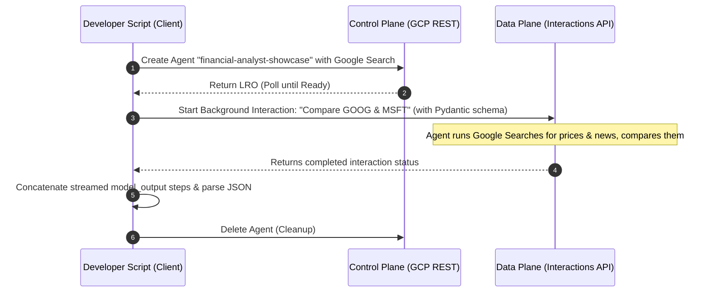
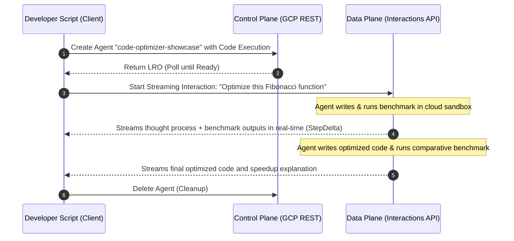
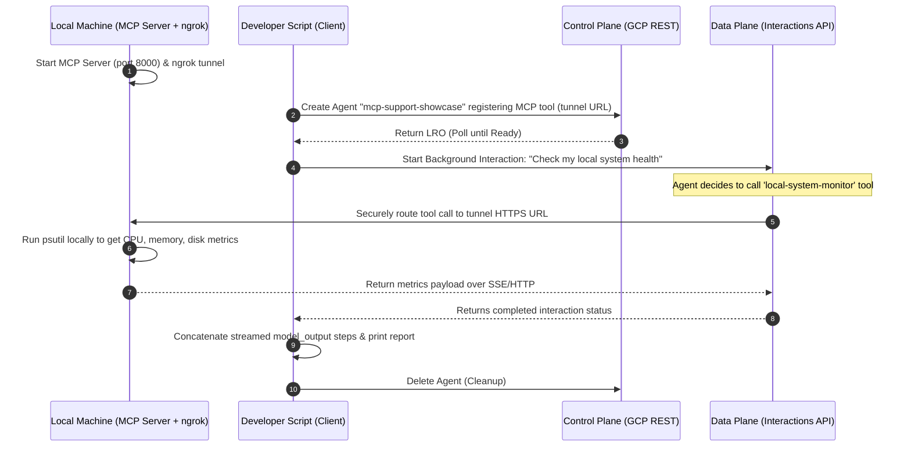

# Gemini Enterprise Agent Platform - Developer Showcase

This showcase contains runnable Python examples demonstrating how to build advanced, stateful agentic workflows by combining the **Control Plane (Managed Agents API)** and the **Data Plane (Interactions API)** of the Gemini Enterprise Agent Platform.

These examples highlight the power of the platform:
1.  **Control Plane (REST)**: Programmatically provisioning, configuring, and deleting custom, stateful agent containers.
2.  **Data Plane (Unified SDK)**: Executing stateful, background-running interactions with support for real-time streaming, structured Pydantic outputs, server-side sandboxed tool execution, and remote MCP tool integration.

---

## Architecture: Control Plane vs. Data Plane

Understanding the division of labor between the Control Plane and the Data Plane is key to building on the platform:

```
┌─────────────────────────────────────────────────────────────────────────┐
│                           GCP Control Plane                             │
│  (Managed Agents API - REST)                                           │
│  - Provision Custom Agents (with system instructions, built-in tools)  │
│  - List, Update, and Delete Agent Containers                           │
└────────────────────────────────────┬────────────────────────────────────┘
                                     │ (Provisions Container)
                                     ▼
┌─────────────────────────────────────────────────────────────────────────┐
│                            GCP Data Plane                               │
│  (Interactions API - google-genai SDK)                                  │
│  - Execute multi-turn, stateful conversations                           │
│  - Securely run server-side tools (e.g., Code Execution Sandbox)         │
│  - Invoke remote/local tools (e.g., Google Search, external MCP servers)│
│  - Stream responses and return structured JSON (Pydantic)               │
└─────────────────────────────────────────────────────────────────────────┘
```

---

## Prerequisites

Before running the examples, ensure you have:
1.  **Python 3.10+** installed.
2.  A **Google Cloud Project** with the Vertex AI API enabled.
3.  **Application Default Credentials (ADC)** configured on your local machine.

### 1. Enable the Vertex AI API
Ensure the `aiplatform.googleapis.com` service is enabled in your Google Cloud project:
```bash
gcloud services enable aiplatform.googleapis.com
```

### 2. Authenticate via ADC
Authenticate your local terminal so the scripts can retrieve your project credentials:
```bash
gcloud auth application-default login
```
Ensure your active project is set (e.g., `agents-api-eval-143444`):
```bash
gcloud config set project YOUR_PROJECT_ID
```

---

## Setup

1.  Navigate to the `showcase` directory:
    ```bash
    cd showcase
    ```
2.  Create and activate a virtual environment:
    ```bash
    python3 -m venv venv
    source venv/bin/activate  # On Windows: venv\Scripts\activate
    ```
3.  Install the dependencies:
    ```bash
    pip install -r requirements.txt
    ```

> [!NOTE]
> **Corporate Registry Workaround**:
> If you are on a corporate network/machine (like a Google corporate Mac) where the default `pip` registry is an internal staging index that lacks public packages, you can install the dependencies directly from the public PyPI by running:
> ```bash
> pip install --index-url https://pypi.org/simple -r requirements.txt
> ```

---

## The Examples

### 1. The Smart Financial Analyst (`financial_analyst.py`)

This example demonstrates how to combine **server-side tools** (Google Search) and **structured Pydantic outputs** in an autonomous background interaction. The agent uses Google Search to find live stock prices and news, analyzes them, and returns a structured Pydantic JSON report.

To handle the chunked/streamed nature of the Interactions API, the script showcases how to **concatenate all `model_output` steps** in the interaction history to reconstruct the complete JSON string before parsing.

#### Flow Diagram:


#### How to Run:
```bash
python financial_analyst/financial_analyst.py
```

---

### 2. The Code Optimizer (`code_optimizer.py`)

This example showcases how the platform handles **server-side tool execution** (the secure Python Code Execution Sandbox) during a **real-time streaming interaction**. 

Because the Code Execution tool runs entirely on the Google Cloud backend, the developer script does not need to handle any tool execution loops—the platform automatically runs the code in its sandbox, observes the output, and streams the entire reasoning process back to the client.

It implements a modern, **event-driven streaming printer** that listens for `step.delta` events and prints both the model's text tokens and the sandbox's terminal outputs in real-time as they are generated.

#### Flow Diagram:


#### How to Run:
```bash
python code_optimizer/code_optimizer.py
```

---

### 3. The Secure Hybrid MCP Support Bot (`mcp_server.py` & `mcp_support.py`)

This example demonstrates how to connect a cloud-hosted agent to a **local MCP (Model Context Protocol) server** running on your own machine. This hybrid architecture allows the cloud agent to securely invoke local tools (such as retrieving local system hardware metrics) via a secure HTTPS tunnel.

The local MCP server is built using the official `mcp` Python SDK's `FastMCP` class and hosted as an **SSE (Server-Sent Events)** application mounted inside **FastAPI**. An `ngrok` tunnel is used to expose the local port to a public HTTPS URL, which is then registered as a tool of type `"mcp"` in the custom agent.

#### Flow Diagram:


#### How to Run:

1.  **Start the Local MCP Server**:
    In your terminal, start the FastAPI server hosting the MCP tool:
    ```bash
    python mcp_support/mcp_server.py
    ```
    The server will start on `http://localhost:8000`, with the SSE connection endpoint at `http://localhost:8000/mcp/sse`.

2.  **Start the secure tunnel (ngrok)**:
    In a **second terminal**, start `ngrok` to expose your local port 8000 to the public internet:
    ```bash
    ngrok http 8000
    ```
    *(If you don't have ngrok installed, you can install it via Homebrew: `brew install ngrok`).*

3.  **Configure and run the Client Script**:
    In a **third terminal**, copy the public HTTPS URL forwarded by ngrok (e.g., `https://xxxx.ngrok-free.app`), append `/mcp/sse` to it, and set it as an environment variable. Then run the client script:
    ```bash
    export MCP_SERVER_URL="https://your-tunnel-id.ngrok-free.app/mcp/sse"
    python mcp_support/mcp_support.py
    ```
    The script will provision the agent, register the MCP tool, trigger the interaction (where the cloud agent calls your local machine), print the system health report, and clean up.

---

## Developer Best Practices Highlighted

*   **Unified SDK**: Always use `from google import genai` (never legacy `google-cloud-aiplatform` or `google-generativeai`).
*   **Latest Models**: Always target modern models like `gemini-3-flash-preview` or `gemini-3.1-flash-lite` (legacy `gemini-2.0` and `gemini-1.5` are unsupported for Interactions).
*   **Resource Cleanup**: Always wrap control plane agent creation and data plane interactions in a `try...finally` block to ensure agent resources are deleted on completion or failure, avoiding backend leaks.
*   **Polymorphic Content Handling**: The `extract_text_from_content` helper function safely handles polymorphic content blocks returned by the server, extracting text whether it is returned as a `Content` object (with `.parts`) or a `TextContent` object (with `.text`).
*   **Event-Driven Streaming**: The streaming loop in `code_optimizer.py` listens for `step.delta` events to print text and sandbox execution logs in real-time, which is much simpler and more efficient than polling.
*   **Secure Hybrid MCP**: The platform securely routes tool requests to the specified MCP server and guarantees header confidentiality by only sending custom headers/tokens to that URL.
