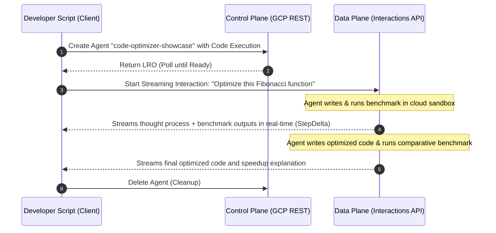

# The Code Optimizer

This example showcases how the platform handles **server-side tool execution** (the secure Python Code Execution Sandbox) during a **real-time streaming interaction**. 

Because the Code Execution tool runs entirely on the Google Cloud backend, the developer script does not need to handle any tool execution loops—the platform automatically runs the code in its sandbox, observes the output, and streams the entire reasoning process back to the client.

It implements a modern, **event-driven streaming printer** that listens for `step.delta` events and prints both the model's text tokens and the sandbox's terminal outputs in real-time as they are generated.

## Flow Diagram



## How to Run

Ensure you have completed the main [setup](file:///Users/zhaofu/workspace/interactions_api/showcase/README.md#setup) first.

Run the script from the `showcase` directory:
```bash
python code_optimizer/code_optimizer.py
```
