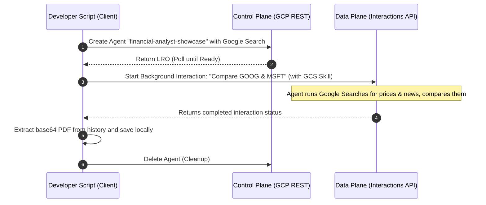

# The Smart Financial Analyst

This example demonstrates how to combine **server-side tools** (Google Search) and a **custom GCS-mounted skill** in an autonomous background interaction. The agent uses Google Search to find live stock prices and news, analyzes them, and uses the custom `pdf_helper` skill to generate a beautiful PDF report.

To handle the chunked/streamed nature of the Interactions API, the script showcases how to **concatenate all `model_output` steps** in the interaction history to reconstruct the complete response.

## Flow Diagram



## How to Run

Ensure you have completed the main [setup](file:///Users/zhaofu/workspace/interactions_api/showcase/README.md#setup) first.

Run the script from the `showcase` directory:
```bash
python financial_analyst/financial_analyst.py
```

Upon success, the script will download and save the generated PDF report to `showcase/financial_analyst/financial_report.pdf`.
