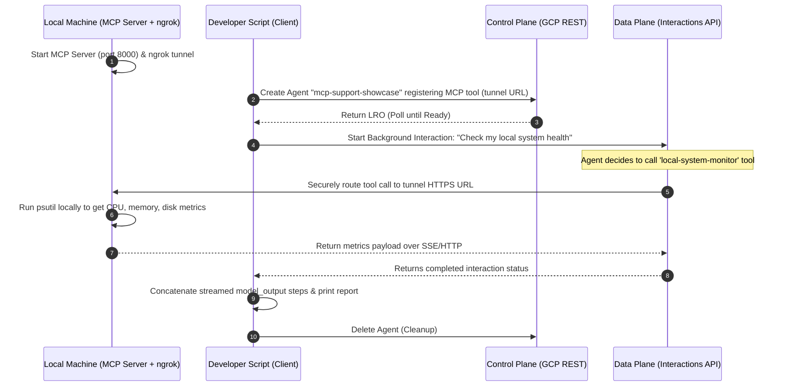

# The Secure Hybrid MCP Support Bot

This example demonstrates how to connect a cloud-hosted agent to a **local MCP (Model Context Protocol) server** running on your own machine. This hybrid architecture allows the cloud agent to securely invoke local tools (such as retrieving local system hardware metrics) via a secure HTTPS tunnel.

The local MCP server is built using the official `mcp` Python SDK's `FastMCP` class and hosted as an **SSE (Server-Sent Events)** application mounted inside **FastAPI**. An `ngrok` tunnel is used to expose the local port to a public HTTPS URL, which is then registered as a tool of type `"mcp"` in the custom agent.

## Flow Diagram



## How to Run

Ensure you have completed the main [setup](file:///Users/zhaofu/workspace/interactions_api/showcase/README.md#setup) first.

### 1. Start the Local MCP Server
From the `showcase` directory, start the FastAPI server hosting the MCP tool:
```bash
python mcp_support/mcp_server.py
```
The server will start on `http://localhost:8000`, with the SSE connection endpoint at `http://localhost:8000/mcp/sse`.

### 2. Start the secure tunnel (ngrok)
In a **second terminal**, start `ngrok` to expose your local port 8000 to the public internet:
```bash
ngrok http 8000
```
*(If you don't have ngrok installed, you can install it via Homebrew: `brew install ngrok`).*

### 3. Configure and run the Client Script
In a **third terminal**, copy the public HTTPS URL forwarded by ngrok (e.g., `https://xxxx.ngrok-free.app`), append `/mcp/sse` to it, and set it as an environment variable. Then run the client script from the `showcase` directory:
```bash
export MCP_SERVER_URL="https://your-tunnel-id.ngrok-free.app/mcp/sse"
python mcp_support/mcp_support.py
```
The script will provision the agent, register the MCP tool, trigger the interaction (where the cloud agent calls your local machine), print the system health report, and clean up.
